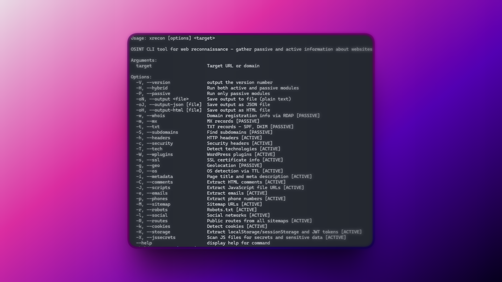
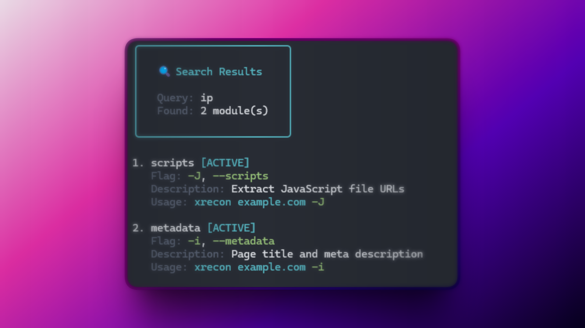
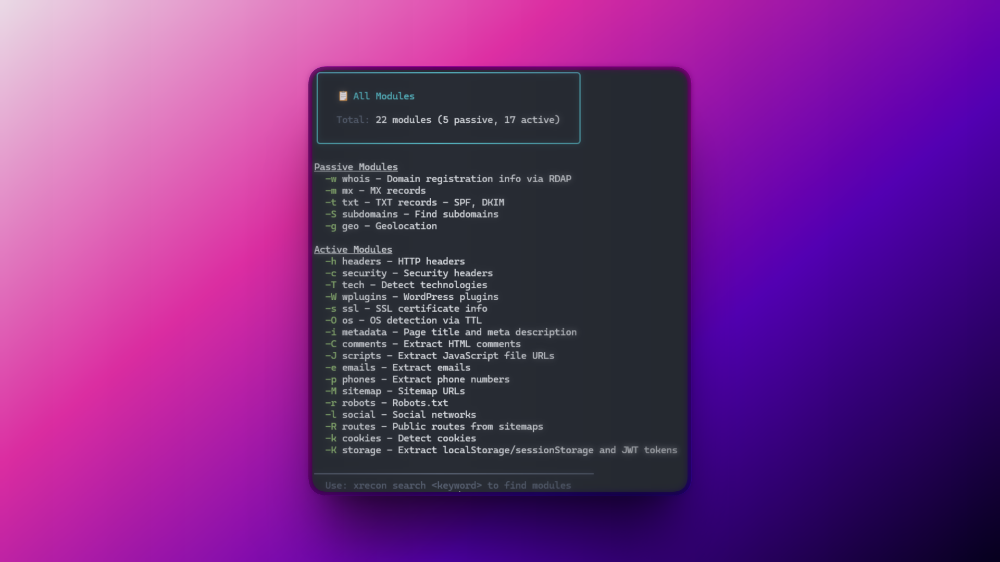

# xrecon

OSINT CLI tool for web reconnaissance - gather passive and active information about websites.

xrecon uses two types of reconnaissance modules to provide a comprehensive view of any target:

**Passive modules** gather information from public sources and third-party APIs without directly interacting with the target. These modules query DNS records, RDAP databases, and other public data sources, making them fast and stealthy.

**Active modules** interact directly with the target website by making HTTP requests, analyzing HTML content, and in some cases using a headless browser. These modules can detect technologies, extract metadata, scan for secrets in JavaScript files, analyze security headers, and much more.

Run modules individually with specific flags, or use `-H` for a full hybrid scan that combines both approaches.



## Installation

xrecon is a CLI tool designed to be installed globally so you can run it from anywhere in your terminal.

### Using npm

```bash
npm install -g @ariaskit/xrecon
```

### Using pnpm

```bash
pnpm add -g @ariaskit/xrecon
```

### From source

```bash
# Clone the repository
git clone https://github.com/JorgeRosbel/xrecon.git
cd xrecon

# Install dependencies
pnpm install

# Build the CLI
pnpm build

# Link globally
pnpm link
```

## Playwright Setup

xrecon uses [Playwright](https://playwright.dev) with a headless Chromium browser to scan dynamic websites (SPAs built with React, Vue, Angular, etc.).

**For static sites:** xrecon works out of the box — no extra setup needed.

**For dynamic sites:** If you see the warning below, it means Playwright's browser binary is not installed:

```
⚠ Warning: Dynamic content unavailable. Run "npx playwright install" to enable full scanning of dynamic sites.
```

To enable full scanning of dynamic sites, install the browser binary:

```bash
npx playwright install
```

This downloads ~150MB of Chromium and only needs to be done once. After that, xrecon will render JavaScript-heavy pages just like a real browser.

## Usage

```bash
# Run all modules (hybrid mode)
xrecon example.com -H

# Run only passive modules
xrecon example.com -P

# Run specific modules
xrecon example.com -w -s -c

# Save output to file
xrecon example.com -H -oN results.json
```

## Commands

### Global Options

| Flag                        | Description                                     |
| --------------------------- | ----------------------------------------------- |
| `-H, --hybrid`              | Run both active and passive modules             |
| `-P, --passive`             | Run only passive modules                        |
| `-oN, --output <file>`      | Save output to file (plain text)                |
| `-oJ, --output-json [file]` | Save output as JSON file (default: output.json) |
| `-oH, --output-html [file]` | Save output as HTML file (default: output.html) |
| `-V, --version`             | Show version number                             |
| `--help`                    | Display help information                        |

### Search & List Commands

| Command                   | Description                                     |
| ------------------------- | ----------------------------------------------- |
| `xrecon search <keyword>` | Search modules by keyword, flag, or description |
| `xrecon list`             | List all available modules                      |

**Search examples:**

```bash
# Search by keyword
xrecon search tech

# Search by type (active or passive)
xrecon search passive

# Search by description
xrecon search email
```



### List all modules

```bash
xrecon list
```



### Passive Modules

| Flag               | Module     | Description                       |
| ------------------ | ---------- | --------------------------------- |
| `-w, --whois`      | whois      | Domain registration info via RDAP |
| `-m, --mx`         | mx         | MX records                        |
| `-t, --txt`        | txt        | TXT records (SPF, DKIM)           |
| `-S, --subdomains` | subdomains | Find subdomains                   |
| `-g, --geo`        | geo        | Geolocation                       |

### Active Modules

| Flag              | Module    | Description                                        |
| ----------------- | --------- | -------------------------------------------------- |
| `-h, --headers`   | headers   | HTTP headers                                       |
| `-c, --security`  | security  | Security headers                                   |
| `-T, --tech`      | tech      | Detect technologies                                |
| `-W, --wplugins`  | wplugins  | WordPress plugins                                  |
| `-s, --ssl`       | ssl       | SSL certificate info                               |
| `-O, --os`        | os        | OS detection via TTL                               |
| `-i, --metadata`  | metadata  | Page title and meta description                    |
| `-C, --comments`  | comments  | Extract HTML comments                              |
| `-J, --scripts`   | scripts   | Extract JavaScript file URLs                       |
| `-e, --emails`    | emails    | Extract emails                                     |
| `-p, --phones`    | phones    | Extract phone numbers                              |
| `-M, --sitemap`   | sitemap   | Sitemap URLs                                       |
| `-r, --robots`    | robots    | Robots.txt                                         |
| `-l, --social`    | social    | Social networks                                    |
| `-R, --routes`    | routes    | Public routes from sitemaps                        |
| `-k, --cookies`   | cookies   | Detect cookies                                     |
| `-K, --storage`   | storage   | Extract localStorage/sessionStorage and JWT tokens |
| `-X, --jssecrets` | jssecrets | Scan JS files for secrets and sensitive data       |

## Examples

### Full scan

```bash
xrecon example.com -H
```

### Passive reconnaissance only

```bash
xrecon example.com -P
```

### Tech detection and HTTP headers

```bash
xrecon example.com -T -h
```


### Tech stack detection with WordPress plugins

```bash
xrecon example.com -T -W
```

### Extract all contact information

```bash
xrecon example.com -e -p
```

### Save results to file

```bash
xrecon example.com -H -oN scan-results.txt
```

### Save results as JSON

```bash
xrecon example.com -H -oJ
# Saves to output.json

xrecon example.com -H -oJ scan.json
# Saves to scan.json
```

### Save results as HTML

```bash
xrecon example.com -H -oH
# Saves to output.html

xrecon example.com -H -oH report.html
# Saves to report.html
```

### Extract HTML comments

```bash
xrecon example.com -C
```

### Extract JavaScript URLs

```bash
xrecon example.com -J
```

### Scan JS files for secrets

```bash
xrecon example.com -X
```

### Tech detection with WordPress plugins

```bash
xrecon example.com -T -W
```

### Search for modules

```bash
# Find modules related to security
xrecon search security

# Find modules by flag
xrecon search -w

# Find modules by keyword
xrecon search email
```

## Requirements

- Node.js >= 18
- pnpm

## License

MIT License - see LICENSE file for details.
